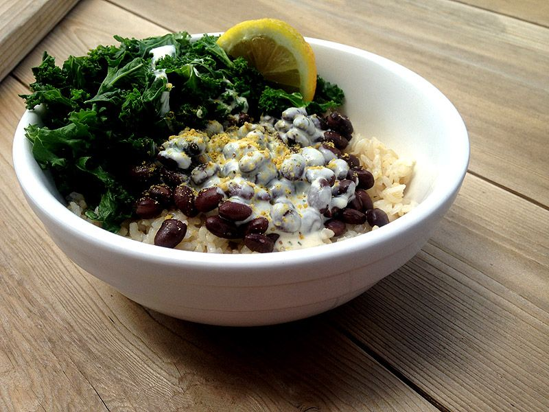

# Greatful Bowl

(Picture shows boring white rice, but i stole the pic from bitch-ass peta so what do you expect)

It's black beans, brown rice, steamed kale but with a raw garlic tahini sauce

## Ingredients

- black beans (i just use caned)
- nice brown rice (the more round and chewy the better)
- kale, dinosaur is best (but in a pinch you can sub any greens to round it out, rocket etc)

### For Sauce

- 2tbsp Tahini per serving
- 1 clove garlic per person (really!)
- 1tbsp Nutritional Yeast (to make it cheeeesy)
- (optional) soy sauce type stuff, maybe some maggi 
- (optional) lemon or lime juice, or even some rice vinegar

## Directions

Start the brown rice cooking. I use a 2-to-1 ratio of water to rice. Put in the water and rice and bring to a boil, once it's rolling turn it down to minimum heat and cover. Brown rice can take like 1/2 an hour or more to cook.

For the sauce, a food processor is best but you can get good results without. Cut up the garlic, and dice it really fine if you're doing everything by hand. Mix in the other good stuff and add small amounts of water slowly as you mix. Salt to taste. Getting the consistency right is key, you want thin enough that it can coat the food well but you don't want watery. If you over water you can always throw a little more tahini and nutritional yeast in.

Steam the kale and heat up the beans and serve.

Pairs well with a peppery vinegary hot sauce.

## Weird Story
 You used to be able to get this at this stupid overpriced vegan restaurant called 'cafe gratitude'. They got knocked almost entirely out of business for wage theft and making employees attend business cult meetings at Landmark Forum 🤮. Anyways you could go to the stall they had in the whole foods and get this item called the 'grateful bowl' that was really basic but had incredible sauce, and because they still had some hippy vibes it was pay what you want. Many a punks were fed through this miracle of capitalism.
