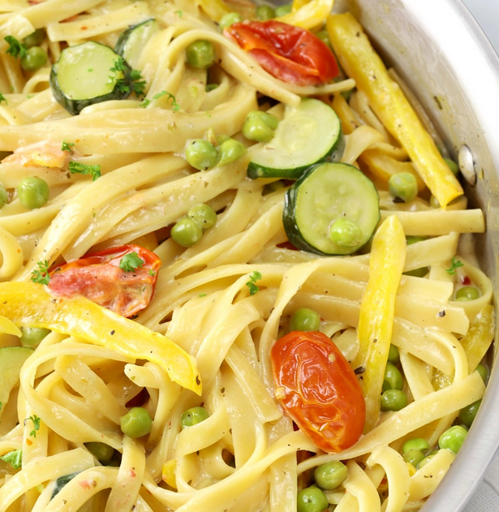

# Lemon Cream Pasta Primavera

This is an awful photo, but something like this, without the peas

## Ingredients
- Pasta, go for something wide like tagliatelle
- 1 Zucchini
- some handfuls of cherry tomatoes
- 1 bell pepper
- garlic to taste
- onions, maybe shallots?

## Sauce
- Cream, vegan version very easy to find these days
- Lemon, best whole but if you just have juice you can use that too
- Parmesan if you want to make it extra

## Extras
Always

## Directions

Start your pasta cooking. You can kinda race it with the cooking veggies if you're clever. Save some of that pasta water!

To get fancy, zest the lemon (grate off the skin) as well as juicing half of it.

In a frying pan soften the garlic and onions and then mix in your chopped zucchini and bell peppers. You can throw the tomatoes in after at least a few minutes of cooking. Salt and pepper these guys while you go.

As you approach veggie done-ness check on your pasta. If it's ready (al dente) pull it and save some of the water.

When you're all ready to combine, turn the heat off in the veggie pan and dump in your lemon zest so it gets some hot pan action, then quickly add the pasta + lemon juice + some cream and stir it up. You can add a little of the pasta water (like 200ml) to help get it all mixed up. If you do it right the sauce becaumes creamy and thick as the more watery parts are absorbed by the remaining hot pasta.