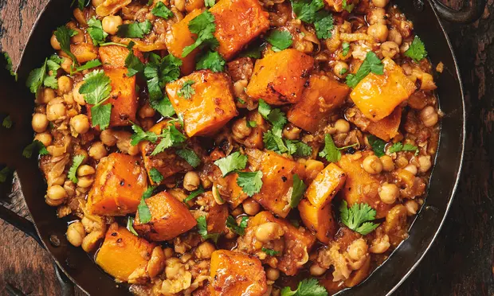

# Squash and chickpeas

This is an ottolenghi one, [found here originally](https://www.theguardian.com/lifeandstyle/2016/nov/12/squash-pumpkin-recipes-yotam-ottolenghi-gnocchi-braised-mash-butternut-coquina-queen)

## Ingredients
- 1 large squash, peeled and cut into 4cm dice (800g)
- 400g tinned cooked chickpeas, drained and rinsed
- 2-3 shallots, peeled and chopped
- 1 sweet pepper (or any thinly chopped vegetable that seems nice as filler)
- 1 garlic clove, peeled and thinly sliced

- 500ml vegetable stock
- 1 tsp cumin
- 1 tsp cardamom
- 1 tsp coriander
- chili flakes or spicey thing
- lots of black pepper
- 1/2 a lemon juice

## Topping
- 10g chopped cilantro
- 150g Greek yoghurt

### Extra stuff if you have it
- 2 tbsp harissa paste
- 1 tsp rose water

## Directions

**Preheat oven to 220c**

Cook the onions and aromatics down a bit in a big saucepan, then add the stock and cubed squash and let it simmer covered until its mostly cooked.

Transfer the squash cubes to a bowl without any liquid, coat them in oil and salt and pepper and then roast them in the oven, for aobut 20 mins or until nice.

Meanwhile dump the chickpeas back into the liquid and cook for another 10-20 minutes. Let the sauce thicken a little bit and you can smash up some of the chickpeas to help.

Once both parts are cooked to your liking put them together and dress with yogurt and cilantro.

