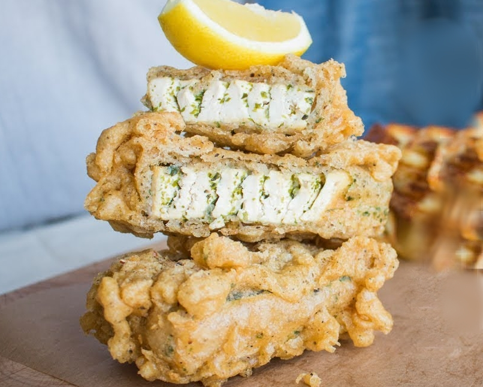

# Tofu Fish and Chips

First saw this from [The Easy Vegan](https://www.youtube.com/watch?v=TcJoUZAtITI)

## Ingredients
- Tofu block, smoked is best but anything firm will do
- (optional) Nori, seaweed, powered or ripped up into fine pieces
- lots of neutral cooking oil, canola or something similar, not olive oil!

## Batter
- Flour
- Baking Powder
- Salt
- you can throw in a tiny bit of tumeric to give the batter a nicer color

## Sauce
- Malt vinegar,  you can use a white vinegar + dash of soy sauce or Maggi seasoning to recreate it
- Mayo-like things are nice for dipping

## Directions
Slice the tofu into flatter squares, whatever size you want the final fillet to end up. I do this by cutting the tofu block length-wise. Then slice each fillet into as many thin strips as you can, taking care not to rip it up. Smoked tofu works the best for this because its the most rubbery and firm.

Sprinkle the nori over the slices getting it on all sides, then push the slices back into the shape of the fillet with two toothpicks pushed through to hold it together.

Make the batter by mixing the dry ingredients and water to the right consistency. You want it thin enough that you can coat the fillet but without it getting watery. 

Heat up the oil in as small of a pan as you can to get the most heigh out of the oil. I use a medium saucepan with high sides.

Lightly coat the fillets in dry flour (use an extra bowl for this) and then fully dunk it into the batter before going straight into the hot oil.

Fry and flip to your heart's contentment.

## Extra notes

Even if you dont have the nori, this still comes out super nice. But! Make sure to thinly slice it into the layers, it makes the post-fry consistency so much nicer.